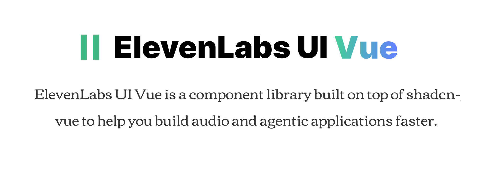

<div align="center">
  
</div>

<br />

<div align="center">
  <a href="https://www.npmjs.com/package/elevenlabs-ui-vue" target="\_parent">
    
  </a>
  <a href="#badge">
    
  </a>
  <a href="https://github.com/vuepont/elevenlabs-ui-vue" target="\_parent">
    
  </a>
</div>

## Overview

[ElevenLabs UI Vue](https://elevenlabs-ui-vue.com) provides pre-built, customizable Vue components specifically designed for agent & audio applications, including orbs, waveforms, voice agents, audio players, and more.
The CLI makes it easy to add these components to your Vue and Nuxt project.

## Installation
You can use the ElevenLabs UI Vue CLI directly with npx, or install it globally:

```bash
# Use directly (recommended)
npx elevenlabs-ui-vue@latest add <component-name>

# Or using shadcn-vue cli
npx shadcn-vue@latest add https://registry.elevenlabs-ui-vue.com/all.json
```

## Prerequisites
Before using ElevenLabs UI Vue, ensure your project meets these requirements:
- **Node.js 18** or later
- **shadcn-vue** initialized in your project (npx shadcn-vue@latest init)
- **Tailwind CSS** configured

## Usage

### Install All Components
Install all available ElevenLabs UI Vue components at once:
```bash
npx elevenlabs-ui-vue@latest
```
This command will:
- Set up shadcn-vue if not already configured
- Install all ElevenLabs UI Vue components to your configured components directory
- Add necessary dependencies to your project

### Install Specific Components
Install individual components using the `add` command:
```bash
npx elevenlabs-ui-vue@latest add <component-name>
```
Examples:
```bash
# Install the orb component
npx elevenlabs-ui-vue@latest add orb
```

### Alternative: Use with shadcn-vue CLI

You can also install components using the standard shadcn-vue CLI:
```bash
# Install all components
npx shadcn-vue@latest add https://registry.elevenlabs-ui-vue.com/all.json

# Install a specific component
npx shadcn-vue@latest add https://registry.elevenlabs-ui-vue.com/orb.json
```

All available components can be found [here](https://elevenlabs-ui-vue.com/docs/components), or explore the list of blocks [here](https://elevenlabs-ui-vue.com/blocks).

## Contributing

If you'd like to contribute to ElevenLabs UI Vue, please follow these steps:

1. Fork the repository
2. Create a new branch
3. Make your changes to the components in `packages/elements/`.
4. Open a PR to the `main` branch.

## Sponsors

ElevenLabs UI Vue is an open-source project supported by our sponsors. If you'd like to support its development, please consider [becoming a sponsor](https://opencollective.com/vuepont).

<p>
  <a href="https://immitranslate.com/" target="_blank" rel="noopener noreferrer">
    
  </a>
</p>

## License

Licensed under the [MIT license](/LICENSE.md).


## Acknowledgments

This project is a direct port of [Elevenlabs UI](https://ui.elevenlabs.io/).

It is not affiliated with, endorsed by, or associated with the ElevenLabs team in any way.

The goal is simply to make a community-driven, similar UI experience for Vue developers.

---

Made with ❤️ by [vuepont](https://github.com/vuepont)
